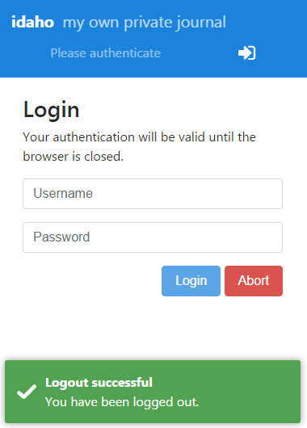
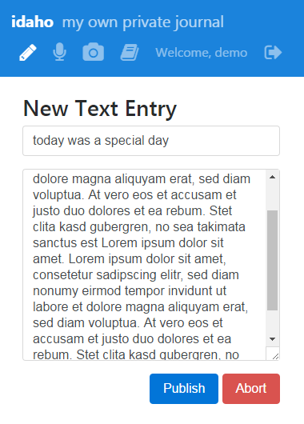
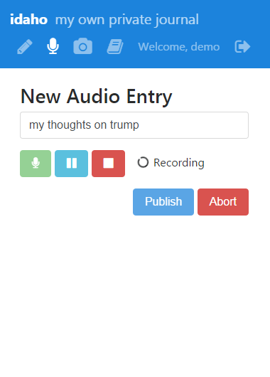
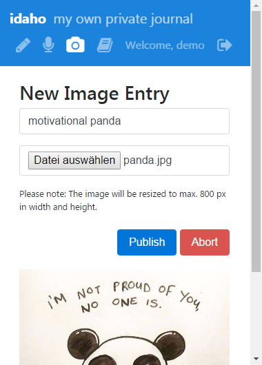
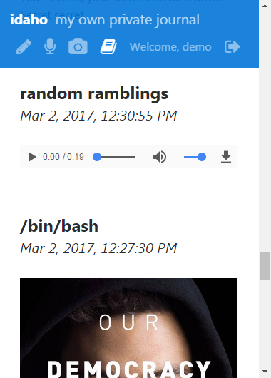

# idaho

**idaho** is an online journal to securely capture snapshots of your life.
No editing functionality included, you wouldn't rewrite a diary, would you?

## Features
* **Multimedia Entry Types**: Text, Image, Audio
* **Client Side Encryption**: The journal can only be viewed with your password.
* **Mobile Friendly**: Take images with your phone and directly publish them.
* **Email Reminder**: Tells you once a day to record your thoughts.

## Demo

You can login as user: **demo** with password: **demo** in the [online demo](http://idaho.cbuelter.de/).

## Screenshots

